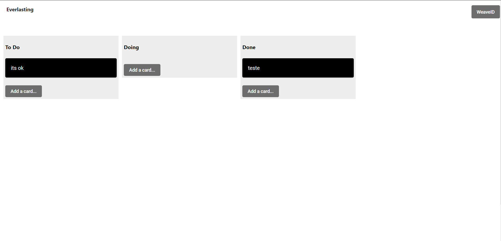

# Everlasting

Trello clone made in Angular 8 using arweave-js to manipulate the data. Based on https://github.com/Dunebook/Trelloclone. Not my idea, saw it on the arweave discord.

Alpha version: https://arweave.net/ZvXbJblZ1ME2DxMTJoXRFTwmxE1NITNWpbIvTFzpZsM.

Beta version: https://arweave.net/DXu5qFTHpr5WjByEkblCXORgS-COSXbnF4pYXCtQ2Co.

## Visuals

## Usage

To run the app locally, navigate to the ar-trello folder and run _**npm install**_ to install all the dependencies and **_npm start_** to run the app.

User manual coming sometime in the future.

## Support

If you have any suggestion, doubt or contribution you can hit me up in Telegram or Twitter @suembra or create an issue in this repository.

## Contributing

If you want to contribute, please check the CONTRIBUTING.md file first.

## Project status

I have some planned improvements/changes that I will be working on soon. You can check the issues tab to see the progress.
