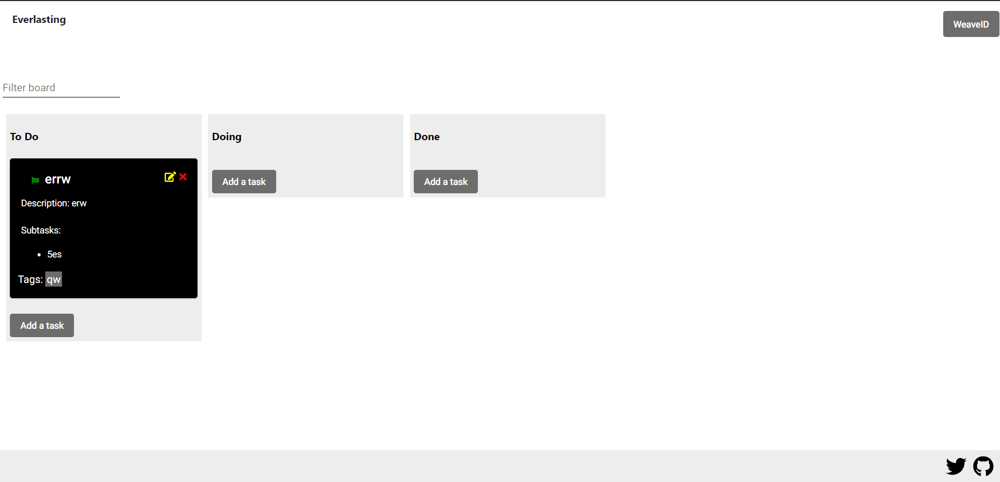

# Arweave Trello

Trello clone made in Agular 8 using arweave-js to manipulate the data. Based on https://github.com/Dunebook/Trelloclone. Not my idea, saw it on the arweave discord.

## Visuals

## Usage

To serve the app, use *ng serve* or *npm start*. Right now, you only can add cards. The cards will disappear in like 30 mins because I don't have a wallet right now.

## Support

If you have any suggestion, doubt or contribution you can hit me up in Telegram or Twitter @suembra or create an issue in this repository.

## Contributing

If you want to contribute, please check the CONTRIBUTING.md file first.

## Project status

I have some planned improvements/changes that I will be working on soon. I will put this live sometime too. You can check the issues tab to see the progress.
